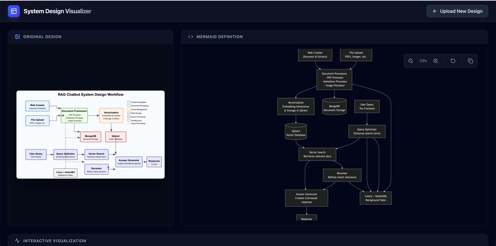
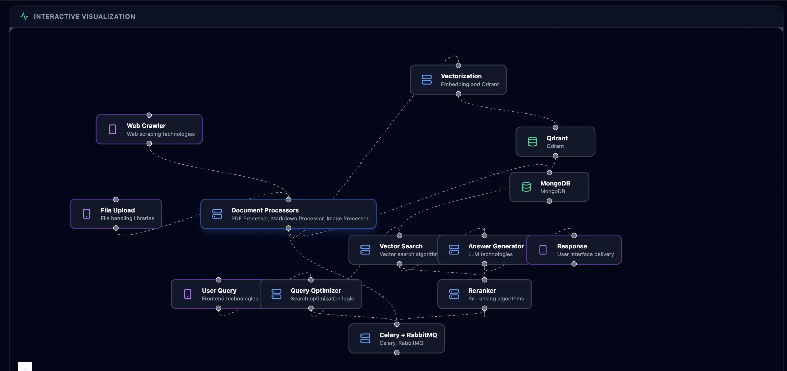

# System Design Visualizer

An interactive tool that transforms static system design diagrams into explorable, interactive visualizations using AI.

## 📸 Screenshots


*Original Image and Mermaid Diagram side-by-side*


*Interactive React Flow Graph*

## 🚀 Features

- **AI-Powered Analysis**: Upload any system design image (architecture diagrams, flowcharts, etc.).
- **Mermaid Generation**: Automatically converts images into editable Mermaid.js diagrams.
- **Interactive Visualization**: Converts Mermaid diagrams into interactive React Flow graphs.
- **Deep Dive**: Click on any component (Load Balancer, Database, etc.) to see inferred details like technology stack and role.
- **Premium UI**: A modern, dark-themed dashboard with zoom, pan, and copy controls.

## 🛠️ Tech Stack

- **Frontend**: React, Vite, Tailwind CSS
- **Visualization**: React Flow, Mermaid.js
- **AI**: OpenAI GPT-4o (Vision & Code Generation)
- **Icons**: Lucide React

## 🏃‍♂️ Running Locally

### Prerequisites

- Node.js (v18 or higher)
- An OpenAI API Key (for AI analysis features)

### Installation

1. **Clone the repository**
   ```bash
   git clone https://github.com/mallahyari/system-design-visualizer.git
   cd system-design-visualizer
   ```

2. **Install dependencies**
   ```bash
   npm install
   ```

3. **Configure Environment**
   Create a `.env` file in the root directory:
   ```bash
   touch .env
   ```
   Add your OpenAI API key:
   ```env
   VITE_OPENAI_API_KEY=your_sk_key_here
   ```
   > **Note**: If no API key is provided, the app will run in **Mock Mode**, generating sample data for testing.

4. **Start the Development Server**
   ```bash
   npm run dev
   ```

5. **Open in Browser**
   Navigate to `http://localhost:5173` to see the app in action.

## 📸 Workflow

1. **Upload**: Drag & drop your system design image.
2. **Review**: See the generated Mermaid diagram code and preview. Use the toolbar to zoom or copy the code.
3. **Convert**: Click "Convert to Interactive" to generate the node-based graph.
4. **Explore**: Interact with the graph nodes to learn more about your system's architecture.

## 🤝 Contributing

Contributions are welcome! Please feel free to submit a Pull Request.

## 📄 License

This project is licensed under the MIT License.
